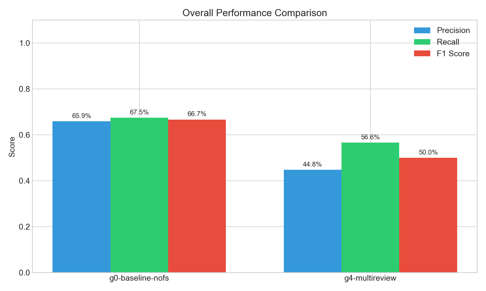
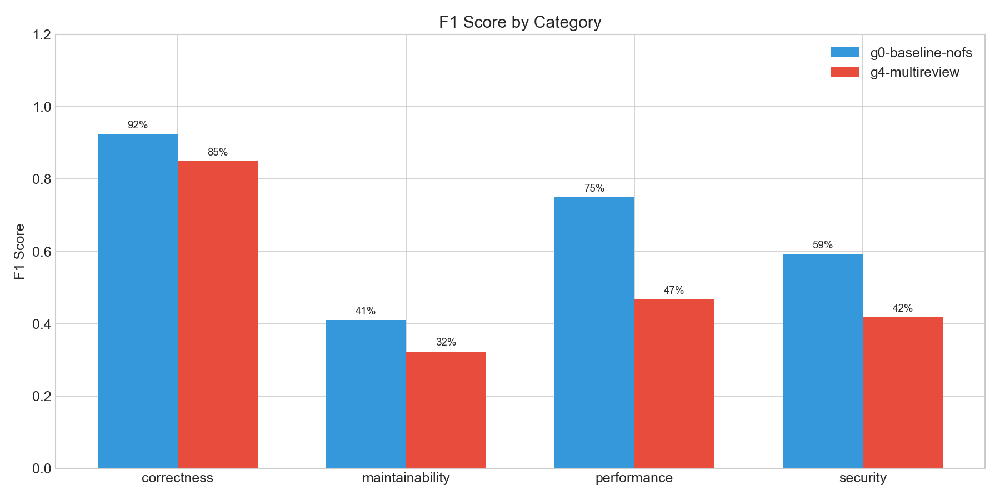
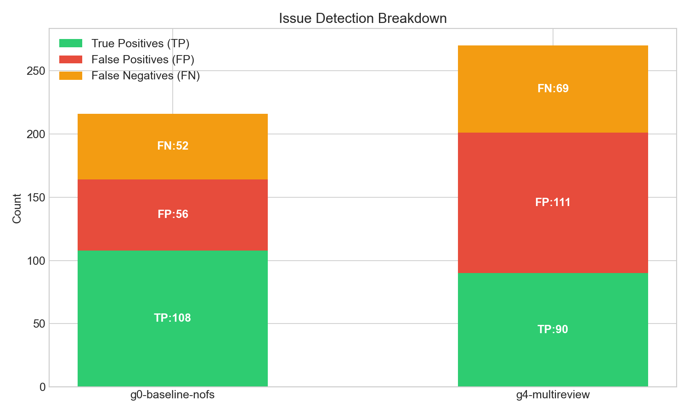
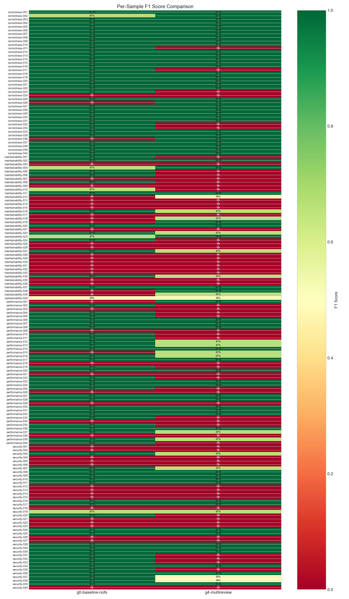
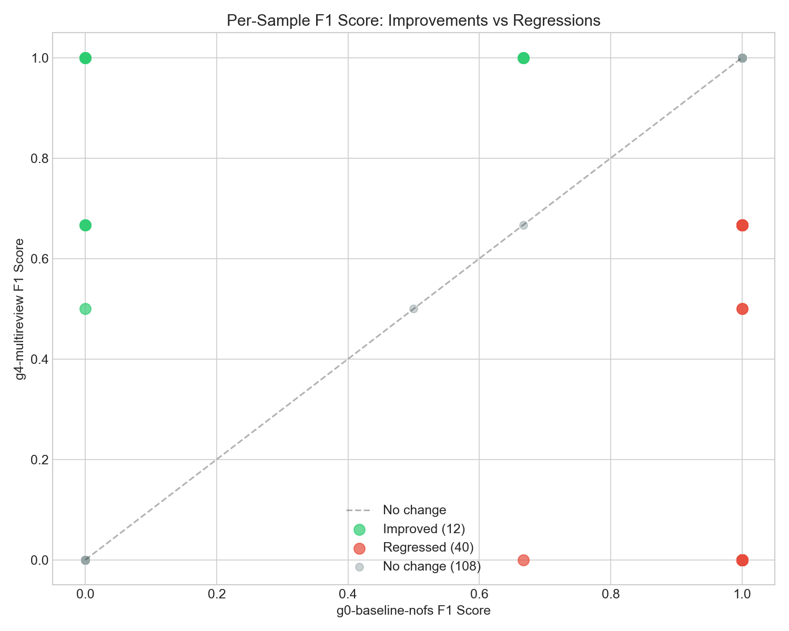

# Evaluation Run Comparison Report

Generated: 2026-01-16T16:00:24.398805

## Overall Summary

| Metric | g0-baseline-nofs | g4-multireview |
|--------|--------|--------|
| Dataset | v1_expanded | v1_expanded |
| Samples | 160 | 159 |
| Duration | 987s | 2109s |
| **F1 Score** | **66.7%** | **50.0%** |
| Precision | 65.9% | 44.8% |
| Recall | 67.5% | 56.6% |
| TP | 108 | 90 |
| FP | 56 | 111 |
| FN | 52 | 69 |

## Per-Category F1 Scores

| Category | g0-baseline-nofs | g4-multireview |
|----------|--------|--------|
| correctness | 92.5% | 85.0% |
| maintainability | 41.0% | 32.3% |
| performance | 75.0% | 46.7% |
| security | 59.3% | 41.8% |

## Delta Analysis: g0-baseline-nofs → g4-multireview

- **F1 Score**: -16.7%
- **Precision**: -21.1%
- **Recall**: -10.9%

### Improvements (12 samples)

| Sample | Before | After | Δ |
|--------|--------|-------|---|
| correctness-026 | 0% | 100% | +100% |
| correctness-036 | 0% | 100% | +100% |
| performance-001 | 0% | 100% | +100% |
| maintainability-019 | 0% | 100% | +100% |
| maintainability-038 | 0% | 100% | +100% |
| performance-015 | 0% | 67% | +67% |
| maintainability-018 | 0% | 67% | +67% |
| maintainability-039 | 0% | 67% | +67% |
| maintainability-012 | 0% | 50% | +50% |
| correctness-002 | 67% | 100% | +33% |
| maintainability-004 | 67% | 100% | +33% |
| maintainability-023 | 67% | 100% | +33% |

### Regressions (40 samples)

| Sample | Before | After | Δ |
|--------|--------|-------|---|
| correctness-011 | 100% | 0% | -100% |
| correctness-017 | 100% | 0% | -100% |
| correctness-023 | 100% | 0% | -100% |
| correctness-032 | 100% | 0% | -100% |
| correctness-033 | 100% | 0% | -100% |
| security-020 | 100% | 0% | -100% |
| security-031 | 100% | 0% | -100% |
| security-032 | 100% | 0% | -100% |
| security-033 | 100% | 0% | -100% |
| security-035 | 100% | 0% | -100% |
| performance-002 | 100% | 0% | -100% |
| performance-004 | 100% | 0% | -100% |
| performance-005 | 100% | 0% | -100% |
| performance-010 | 100% | 0% | -100% |
| performance-011 | 100% | 0% | -100% |
| performance-019 | 100% | 0% | -100% |
| performance-022 | 100% | 0% | -100% |
| performance-025 | 100% | 0% | -100% |
| performance-033 | 100% | 0% | -100% |
| performance-035 | 100% | 0% | -100% |
| performance-040 | 100% | 0% | -100% |
| maintainability-001 | 100% | 0% | -100% |
| maintainability-005 | 100% | 0% | -100% |
| maintainability-006 | 100% | 0% | -100% |
| maintainability-008 | 100% | 0% | -100% |
| maintainability-024 | 100% | 0% | -100% |
| maintainability-010 | 67% | 0% | -67% |
| security-037 | 100% | 50% | -50% |
| security-038 | 100% | 50% | -50% |
| security-003 | 100% | 67% | -33% |
| security-007 | 100% | 67% | -33% |
| performance-012 | 100% | 67% | -33% |
| performance-013 | 100% | 67% | -33% |
| performance-016 | 100% | 67% | -33% |
| performance-037 | 100% | 67% | -33% |
| performance-039 | 100% | 67% | -33% |
| maintainability-016 | 100% | 67% | -33% |
| maintainability-022 | 100% | 67% | -33% |
| maintainability-027 | 100% | 67% | -33% |
| maintainability-034 | 100% | 67% | -33% |

## Visualizations

